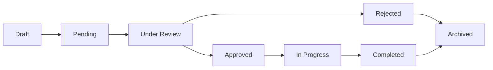

# 🔌 API Documentation & Developer Guide

**Last Updated:** October 29, 2025  
**Platform:** Treis Adiutor Project Execution and Management System (PEMS)  
**Version:** 2.0  
**Base URL:** `https://your-domain.com/api/v1`

---

## 📋 Table of Contents

1. [Authentication](#authentication)
2. [Core Resources](#core-resources)
3. [Service Requests API](#service-requests-api)
4. [Projects API](#projects-api)
5. [Tasks API](#tasks-api)
6. [Users API](#users-api)
7. [Dashboard Analytics](#dashboard-analytics)
8. [File Management](#file-management)
9. [Notifications](#notifications)
10. [Payment Processing](#payment-processing)
11. [Webhooks](#webhooks)
12. [Error Handling](#error-handling)
13. [Rate Limiting](#rate-limiting)
14. [SDK & Libraries](#sdk--libraries)

---

## 🔐 Authentication

### Authentication Methods

#### 1. API Token Authentication (Recommended)
```http
Authorization: Bearer YOUR_API_TOKEN
```

#### 2. Session-Based Authentication
```http
Cookie: laravel_session=YOUR_SESSION_TOKEN
```

#### 3. Auth0 OAuth 2.0
```http
Authorization: Bearer YOUR_OAUTH_TOKEN
```

### Obtaining API Tokens

**Endpoint:** `POST /auth/tokens`

**Request:**
```json
{
    "email": "user@example.com",
    "password": "your_password",
    "token_name": "My API Integration",
    "abilities": ["read", "write"]
}
```

**Response:**
```json
{
    "success": true,
    "data": {
        "token": "1|abc123def456...",
        "expires_at": "2026-01-01T00:00:00Z",
        "abilities": ["read", "write"]
    }
}
```

### Token Management

#### List User Tokens
```http
GET /auth/tokens
Authorization: Bearer YOUR_TOKEN
```

#### Revoke Token
```http
DELETE /auth/tokens/{token_id}
Authorization: Bearer YOUR_TOKEN
```

---

## 🏗️ Core Resources

### Resource Structure

All API resources follow consistent patterns:

#### Standard Response Format
```json
{
    "success": true,
    "data": {
        // Resource data or array of resources
    },
    "meta": {
        "current_page": 1,
        "total": 100,
        "per_page": 15
    },
    "links": {
        "first": "https://api.example.com/resource?page=1",
        "last": "https://api.example.com/resource?page=7",
        "prev": null,
        "next": "https://api.example.com/resource?page=2"
    }
}
```

#### Error Response Format
```json
{
    "success": false,
    "message": "Validation failed",
    "errors": {
        "field_name": ["Field is required"]
    },
    "code": "VALIDATION_ERROR"
}
```

### Common Query Parameters

| Parameter | Type | Description | Example |
|-----------|------|-------------|---------|
| `page` | integer | Page number for pagination | `?page=2` |
| `per_page` | integer | Items per page (max 100) | `?per_page=50` |
| `sort` | string | Sort field and direction | `?sort=created_at,desc` |
| `filter` | object | Filter conditions | `?filter[status]=active` |
| `include` | string | Related resources to include | `?include=user,project` |
| `fields` | string | Specific fields to return | `?fields=id,name,status` |

---

## 📋 Service Requests API

### List Service Requests

**Endpoint:** `GET /service-requests`

**Query Parameters:**
- `status`: Filter by status (pending, approved, rejected, completed)
- `priority`: Filter by priority (low, medium, high, urgent)
- `category`: Filter by category
- `client_id`: Filter by client
- `created_after`: Filter by creation date
- `budget_min`: Minimum budget filter
- `budget_max`: Maximum budget filter

**Example:**
```http
GET /service-requests?status=pending&priority=high&include=client,category
Authorization: Bearer YOUR_TOKEN
```

**Response:**
```json
{
    "success": true,
    "data": [
        {
            "id": 1,
            "title": "Website Development Project",
            "description": "Need a modern website for our business",
            "status": "pending",
            "priority": "high",
            "estimated_budget": 15000.00,
            "deadline": "2026-02-15",
            "created_at": "2025-10-29T10:00:00Z",
            "client": {
                "id": 5,
                "name": "John Doe",
                "email": "john@example.com"
            },
            "category": {
                "id": 2,
                "name": "Web Development",
                "description": "Website and web application development"
            },
            "attachments": [
                {
                    "id": 10,
                    "filename": "requirements.pdf",
                    "size": 2048576,
                    "url": "https://storage.example.com/files/requirements.pdf"
                }
            ]
        }
    ],
    "meta": {
        "current_page": 1,
        "total": 25,
        "per_page": 15
    }
}
```

### Create Service Request

**Endpoint:** `POST /service-requests`

**Request:**
```json
{
    "title": "Mobile App Development",
    "description": "iOS and Android app for food delivery",
    "category_id": 3,
    "priority": "medium",
    "estimated_budget": 25000.00,
    "deadline": "2026-03-01",
    "requirements": {
        "platforms": ["iOS", "Android"],
        "features": ["GPS tracking", "Payment integration", "Push notifications"]
    },
    "attachments": [
        {
            "filename": "app_mockups.zip",
            "content": "base64_encoded_file_content"
        }
    ]
}
```

**Response:**
```json
{
    "success": true,
    "data": {
        "id": 26,
        "title": "Mobile App Development",
        "status": "pending",
        "reference_number": "SR-2025-026",
        "created_at": "2025-10-29T14:30:00Z",
        "estimated_review_time": "2-3 business days"
    }
}
```

### Update Service Request

**Endpoint:** `PUT /service-requests/{id}`

**Request:**
```json
{
    "status": "approved",
    "admin_notes": "Approved for development. Assigned to Team A.",
    "final_budget": 23000.00,
    "approved_timeline": "8 weeks"
}
```

### Service Request Status Workflow



---

## 🏗️ Projects API

### List Projects

**Endpoint:** `GET /projects`

**Query Parameters:**
- `status`: Filter by project status
- `client_id`: Filter by client
- `adiutor_id`: Filter by assigned adiutor
- `budget_min`/`budget_max`: Budget range filter
- `deadline_before`/`deadline_after`: Timeline filters

**Example:**
```http
GET /projects?status=active&include=client,adiutors,tasks
Authorization: Bearer YOUR_TOKEN
```

**Response:**
```json
{
    "success": true,
    "data": [
        {
            "id": 15,
            "name": "E-commerce Platform Development",
            "description": "Full-stack e-commerce solution",
            "status": "in_progress",
            "budget": 45000.00,
            "spent": 22500.00,
            "progress_percentage": 60,
            "start_date": "2025-09-01",
            "deadline": "2025-12-15",
            "created_at": "2025-08-25T09:00:00Z",
            "client": {
                "id": 8,
                "name": "Tech Solutions Inc",
                "contact_person": "Sarah Johnson"
            },
            "adiutors": [
                {
                    "id": 12,
                    "name": "Alex Rodriguez",
                    "role": "Lead Developer",
                    "hours_allocated": 200,
                    "hours_logged": 120
                }
            ],
            "milestones": [
                {
                    "id": 1,
                    "title": "Backend API Development",
                    "status": "completed",
                    "due_date": "2025-10-15",
                    "completion_date": "2025-10-12"
                }
            ]
        }
    ]
}
```

### Create Project

**Endpoint:** `POST /projects`

**Request:**
```json
{
    "service_request_id": 26,
    "name": "Mobile Food Delivery App",
    "description": "iOS and Android application development",
    "budget": 25000.00,
    "start_date": "2025-11-01",
    "deadline": "2026-02-28",
    "client_id": 5,
    "adiutor_ids": [12, 15, 18],
    "milestones": [
        {
            "title": "UI/UX Design Phase",
            "description": "Complete app design and user flow",
            "due_date": "2025-11-15",
            "budget_allocation": 5000.00
        },
        {
            "title": "Backend Development",
            "description": "API and database development",
            "due_date": "2025-12-31",
            "budget_allocation": 12000.00
        }
    ]
}
```

### Project Analytics

**Endpoint:** `GET /projects/{id}/analytics`

**Response:**
```json
{
    "success": true,
    "data": {
        "budget_analysis": {
            "total_budget": 25000.00,
            "spent": 15000.00,
            "remaining": 10000.00,
            "utilization_percentage": 60,
            "projected_overspend": 0,
            "weekly_burn_rate": 2500.00
        },
        "timeline_analysis": {
            "total_days": 120,
            "elapsed_days": 72,
            "remaining_days": 48,
            "progress_percentage": 65,
            "on_track": true,
            "projected_completion": "2026-02-20"
        },
        "team_performance": {
            "total_hours_logged": 240,
            "average_daily_hours": 8.5,
            "productivity_score": 0.85,
            "task_completion_rate": 0.78
        }
    }
}
```

---

## ✅ Tasks API

### List Tasks

**Endpoint:** `GET /tasks`

**Query Parameters:**
- `project_id`: Filter by project
- `assignee_id`: Filter by assigned user
- `status`: Filter by task status
- `priority`: Filter by priority level
- `due_before`/`due_after`: Due date filters

**Example:**
```http
GET /tasks?project_id=15&status=in_progress&include=assignee,project
Authorization: Bearer YOUR_TOKEN
```

### Create Task

**Endpoint:** `POST /tasks`

**Request:**
```json
{
    "project_id": 15,
    "title": "Implement Payment Gateway",
    "description": "Integrate Stripe payment processing",
    "assignee_id": 12,
    "priority": "high",
    "estimated_hours": 16,
    "due_date": "2025-11-15",
    "budget_allocation": 2000.00,
    "dependencies": [23, 24],
    "requirements": [
        "Support credit cards and digital wallets",
        "Implement webhook handling",
        "Add payment history tracking"
    ]
}
```

### Task Time Tracking

**Endpoint:** `POST /tasks/{id}/time-entries`

**Request:**
```json
{
    "hours": 4.5,
    "description": "Implemented Stripe webhook handler",
    "date": "2025-10-29",
    "billable": true
}
```

**Get Time Entries:**
```http
GET /tasks/{id}/time-entries
```

---

## 👥 Users API

### List Users

**Endpoint:** `GET /users`

**Query Parameters:**
- `role`: Filter by user role (admin, client, adiutor)
- `status`: Filter by account status
- `skills`: Filter adiutors by skills
- `availability`: Filter by availability status

### User Profile

**Endpoint:** `GET /users/{id}`

**Response:**
```json
{
    "success": true,
    "data": {
        "id": 12,
        "name": "Alex Rodriguez",
        "email": "alex@example.com",
        "role": "adiutor",
        "status": "active",
        "profile": {
            "title": "Senior Full-Stack Developer",
            "bio": "10+ years experience in web development",
            "hourly_rate": 85.00,
            "availability": "available",
            "skills": [
                {"name": "Laravel", "level": "expert"},
                {"name": "React", "level": "advanced"},
                {"name": "AWS", "level": "intermediate"}
            ],
            "certifications": [
                "AWS Certified Developer",
                "Laravel Certified"
            ]
        },
        "statistics": {
            "projects_completed": 15,
            "total_hours_logged": 1250,
            "average_rating": 4.8,
            "on_time_delivery": 0.95
        }
    }
}
```

### Update User Profile

**Endpoint:** `PUT /users/{id}`

**Request:**
```json
{
    "profile": {
        "title": "Lead Full-Stack Developer",
        "hourly_rate": 95.00,
        "skills": [
            {"name": "Laravel", "level": "expert"},
            {"name": "Vue.js", "level": "advanced"}
        ]
    }
}
```

---

## 📊 Dashboard Analytics

### Overview Analytics

**Endpoint:** `GET /analytics/overview`

**Query Parameters:**
- `period`: Time period (today, week, month, quarter, year)
- `start_date`/`end_date`: Custom date range

**Response:**
```json
{
    "success": true,
    "data": {
        "service_requests": {
            "total": 125,
            "pending": 8,
            "approved": 15,
            "completed": 102,
            "growth_rate": 0.15
        },
        "projects": {
            "active": 12,
            "completed": 45,
            "on_track": 10,
            "at_risk": 2,
            "average_completion_time": 67.5
        },
        "financial": {
            "total_revenue": 245000.00,
            "monthly_recurring": 15000.00,
            "outstanding_payments": 8500.00,
            "profit_margin": 0.35
        },
        "team_performance": {
            "total_adiutors": 25,
            "active_adiutors": 18,
            "average_utilization": 0.82,
            "client_satisfaction": 4.7
        }
    }
}
```

### Project Performance Analytics

**Endpoint:** `GET /analytics/projects`

**Response:**
```json
{
    "success": true,
    "data": {
        "completion_trends": [
            {
                "month": "2025-10",
                "completed": 8,
                "started": 12,
                "completion_rate": 0.67
            }
        ],
        "budget_performance": {
            "average_variance": 0.05,
            "projects_over_budget": 2,
            "projects_under_budget": 15,
            "cost_efficiency": 0.95
        },
        "timeline_performance": {
            "on_time_delivery": 0.85,
            "average_delay_days": 3.2,
            "early_completion_rate": 0.25
        }
    }
}
```

### Custom Analytics

**Endpoint:** `POST /analytics/custom`

**Request:**
```json
{
    "metrics": ["revenue", "project_count", "client_satisfaction"],
    "groupBy": "month",
    "filters": {
        "date_range": {
            "start": "2025-01-01",
            "end": "2025-12-31"
        },
        "client_ids": [5, 8, 12]
    },
    "aggregations": ["sum", "average", "count"]
}
```

---

## 📁 File Management

### Upload Files

**Endpoint:** `POST /files`

**Request (Multipart Form):**
```http
Content-Type: multipart/form-data

file: [binary file data]
type: "document" | "image" | "video" | "other"
related_type: "service_request" | "project" | "task"
related_id: 123
description: "Project requirements document"
```

**Response:**
```json
{
    "success": true,
    "data": {
        "id": 156,
        "filename": "requirements.pdf",
        "original_name": "Project Requirements v2.pdf",
        "size": 2048576,
        "mime_type": "application/pdf",
        "url": "https://storage.example.com/files/requirements.pdf",
        "download_url": "https://api.example.com/files/156/download",
        "created_at": "2025-10-29T15:30:00Z"
    }
}
```

### Download Files

**Endpoint:** `GET /files/{id}/download`

Returns the file content with appropriate headers for download.

### List Files

**Endpoint:** `GET /files`

**Query Parameters:**
- `type`: Filter by file type
- `related_type`/`related_id`: Filter by related resource
- `search`: Search in filename and description

---

## 🔔 Notifications

### List Notifications

**Endpoint:** `GET /notifications`

**Query Parameters:**
- `read`: Filter by read status (true/false)
- `type`: Filter by notification type
- `priority`: Filter by priority level

**Response:**
```json
{
    "success": true,
    "data": [
        {
            "id": "uuid-123",
            "type": "project_milestone_completed",
            "title": "Milestone Completed",
            "message": "Backend API Development milestone has been completed",
            "priority": "medium",
            "read": false,
            "data": {
                "project_id": 15,
                "milestone_id": 1,
                "completion_date": "2025-10-12"
            },
            "created_at": "2025-10-12T16:45:00Z"
        }
    ]
}
```

### Mark as Read

**Endpoint:** `PUT /notifications/{id}/read`

### Notification Preferences

**Endpoint:** `GET /notifications/preferences`

**Response:**
```json
{
    "success": true,
    "data": {
        "email_notifications": true,
        "push_notifications": true,
        "sms_notifications": false,
        "notification_types": {
            "project_updates": true,
            "payment_confirmations": true,
            "milestone_alerts": true,
            "budget_warnings": true
        },
        "frequency": "immediate"
    }
}
```

### Update Preferences

**Endpoint:** `PUT /notifications/preferences`

---

## 💳 Payment Processing

### Create Payment

**Endpoint:** `POST /payments`

**Request:**
```json
{
    "amount": 5000.00,
    "currency": "USD",
    "description": "Project milestone payment",
    "project_id": 15,
    "payment_method": "card",
    "return_url": "https://client-app.com/payment/success",
    "cancel_url": "https://client-app.com/payment/cancel"
}
```

**Response:**
```json
{
    "success": true,
    "data": {
        "payment_id": "pay_abc123",
        "amount": 5000.00,
        "status": "pending",
        "checkout_url": "https://payments.maya.ph/checkout/abc123",
        "expires_at": "2025-10-29T17:00:00Z"
    }
}
```

### Payment Status

**Endpoint:** `GET /payments/{payment_id}`

**Response:**
```json
{
    "success": true,
    "data": {
        "id": "pay_abc123",
        "amount": 5000.00,
        "status": "completed",
        "transaction_id": "txn_def456",
        "payment_method": "card",
        "processed_at": "2025-10-29T16:30:00Z",
        "fees": 150.00,
        "net_amount": 4850.00
    }
}
```

### Payment History

**Endpoint:** `GET /payments`

**Query Parameters:**
- `status`: Filter by payment status
- `project_id`: Filter by project
- `amount_min`/`amount_max`: Amount range filter
- `date_from`/`date_to`: Date range filter

---

## 🪝 Webhooks

### Register Webhook

**Endpoint:** `POST /webhooks`

**Request:**
```json
{
    "url": "https://your-app.com/webhooks/treis-adiutor",
    "events": [
        "project.created",
        "project.completed",
        "payment.completed",
        "task.assigned"
    ],
    "secret": "your_webhook_secret",
    "active": true
}
```

### Webhook Events

#### Available Events
- `service_request.created`
- `service_request.approved`
- `service_request.rejected`
- `project.created`
- `project.updated`
- `project.completed`
- `task.created`
- `task.completed`
- `payment.completed`
- `payment.failed`
- `user.created`
- `milestone.completed`

#### Webhook Payload Format
```json
{
    "id": "evt_abc123",
    "event": "project.completed",
    "created_at": "2025-10-29T16:45:00Z",
    "data": {
        "object": "project",
        "id": 15,
        "name": "E-commerce Platform Development",
        "status": "completed",
        "completion_date": "2025-10-29T16:45:00Z",
        "final_budget": 43500.00,
        "client": {
            "id": 8,
            "name": "Tech Solutions Inc"
        }
    }
}
```

### Webhook Verification

Verify webhook authenticity using HMAC-SHA256:

```php
$signature = hash_hmac('sha256', $payload, $webhook_secret);
$expected = 'sha256=' . $signature;

if (hash_equals($expected, $_SERVER['HTTP_X_WEBHOOK_SIGNATURE'])) {
    // Webhook is authentic
}
```

---

## ⚠️ Error Handling

### HTTP Status Codes

| Code | Description | Example Usage |
|------|-------------|---------------|
| 200 | OK | Successful GET, PUT requests |
| 201 | Created | Successful POST requests |
| 204 | No Content | Successful DELETE requests |
| 400 | Bad Request | Invalid request format |
| 401 | Unauthorized | Invalid or missing authentication |
| 403 | Forbidden | Insufficient permissions |
| 404 | Not Found | Resource doesn't exist |
| 422 | Unprocessable Entity | Validation errors |
| 429 | Too Many Requests | Rate limit exceeded |
| 500 | Internal Server Error | Server error |

### Error Response Examples

#### Validation Error (422)
```json
{
    "success": false,
    "message": "The given data was invalid.",
    "errors": {
        "email": ["The email field is required."],
        "budget": ["The budget must be greater than 0."]
    },
    "code": "VALIDATION_ERROR"
}
```

#### Authentication Error (401)
```json
{
    "success": false,
    "message": "Unauthenticated.",
    "code": "AUTHENTICATION_REQUIRED"
}
```

#### Authorization Error (403)
```json
{
    "success": false,
    "message": "This action is unauthorized.",
    "code": "INSUFFICIENT_PERMISSIONS"
}
```

#### Rate Limit Error (429)
```json
{
    "success": false,
    "message": "Too many requests. Please try again later.",
    "code": "RATE_LIMIT_EXCEEDED",
    "retry_after": 60
}
```

---

## 🚦 Rate Limiting

### Rate Limits

| User Type | Requests per Minute | Requests per Hour |
|-----------|-------------------|------------------|
| Public | 60 | 1,000 |
| Authenticated | 120 | 5,000 |
| Premium | 300 | 15,000 |
| Enterprise | 1,000 | 50,000 |

### Rate Limit Headers

All API responses include rate limit information:

```http
X-RateLimit-Limit: 120
X-RateLimit-Remaining: 95
X-RateLimit-Reset: 1698765600
```

### Rate Limit Handling

When rate limit is exceeded:

```json
{
    "success": false,
    "message": "Rate limit exceeded. Try again in 47 seconds.",
    "code": "RATE_LIMIT_EXCEEDED",
    "retry_after": 47
}
```

**Best Practices:**
- Implement exponential backoff
- Cache responses when possible
- Use batch operations for multiple resources
- Monitor rate limit headers

---

## 🛠️ SDK & Libraries

### Official SDKs

#### PHP SDK
```bash
composer require treis-adiutor/php-sdk
```

```php
use TreisAdiutor\SDK\Client;

$client = new Client([
    'api_token' => 'your_api_token',
    'base_url' => 'https://your-domain.com/api/v1'
]);

// List service requests
$requests = $client->serviceRequests()->list([
    'status' => 'pending',
    'priority' => 'high'
]);

// Create project
$project = $client->projects()->create([
    'name' => 'New Project',
    'budget' => 25000,
    'client_id' => 5
]);
```

#### JavaScript SDK
```bash
npm install @treis-adiutor/js-sdk
```

```javascript
import TreisAdiutor from '@treis-adiutor/js-sdk';

const client = new TreisAdiutor({
    apiToken: 'your_api_token',
    baseUrl: 'https://your-domain.com/api/v1'
});

// Async/await usage
const projects = await client.projects.list({
    status: 'active',
    include: 'client,adiutors'
});

// Promise usage
client.tasks.create({
    title: 'New Task',
    project_id: 15,
    assignee_id: 12
}).then(task => {
    console.log('Task created:', task);
});
```

#### Python SDK
```bash
pip install treis-adiutor-sdk
```

```python
from treis_adiutor import Client

client = Client(
    api_token='your_api_token',
    base_url='https://your-domain.com/api/v1'
)

# List users
users = client.users.list(role='adiutor', status='active')

# Create service request
request = client.service_requests.create({
    'title': 'Website Development',
    'description': 'Need a new company website',
    'category_id': 2,
    'priority': 'medium'
})
```

### Third-Party Libraries

#### cURL Examples

**List Projects:**
```bash
curl -X GET "https://your-domain.com/api/v1/projects" \
  -H "Authorization: Bearer YOUR_API_TOKEN" \
  -H "Accept: application/json"
```

**Create Task:**
```bash
curl -X POST "https://your-domain.com/api/v1/tasks" \
  -H "Authorization: Bearer YOUR_API_TOKEN" \
  -H "Content-Type: application/json" \
  -d '{
    "title": "Implement API endpoint",
    "project_id": 15,
    "assignee_id": 12,
    "priority": "high"
  }'
```

### Postman Collection

Import our comprehensive Postman collection for testing:

**Collection URL:** `https://your-domain.com/api/postman-collection.json`

The collection includes:
- Pre-configured authentication
- All API endpoints with examples
- Environment variables for different stages
- Automated testing scripts

---

## 🔧 Developer Tools

### API Explorer

Interactive API documentation available at:
`https://your-domain.com/api/docs`

Features:
- Try endpoints directly in browser
- Authentication testing
- Response examples
- Schema validation

### Development Environment

#### Local Development Setup
```bash
# Clone the repository
git clone https://github.com/your-org/treis-adiutor.git

# Install dependencies
composer install
npm install

# Environment setup
cp .env.example .env
php artisan key:generate

# Database setup
php artisan migrate
php artisan db:seed

# Start development server
php artisan serve
npm run dev
```

#### API Testing

**Unit Tests:**
```bash
php artisan test --filter=ApiTest
```

**Integration Tests:**
```bash
php artisan test --group=integration
```

**Load Testing:**
```bash
# Using Apache Bench
ab -n 1000 -c 10 -H "Authorization: Bearer TOKEN" \
  https://your-domain.com/api/v1/projects

# Using Artillery
artillery run api-load-test.yml
```

### Monitoring & Debugging

#### API Monitoring Dashboard
- Real-time API performance metrics
- Error rate monitoring
- Response time tracking
- Usage analytics by endpoint

#### Debug Headers

Include debug information in development:

```http
X-Debug-Mode: true
```

Response includes additional debugging data:
```json
{
    "success": true,
    "data": {...},
    "debug": {
        "query_count": 12,
        "execution_time": "0.245s",
        "memory_usage": "15.2MB",
        "cache_hits": 8
    }
}
```

---

## 📞 Support & Resources

### Documentation
- **API Reference:** `https://your-domain.com/api/docs`
- **Guides & Tutorials:** `https://your-domain.com/developers/guides`
- **Changelog:** `https://your-domain.com/developers/changelog`

### Support Channels
- **Email:** developers@treis-adiutor.com
- **Developer Forum:** `https://community.treis-adiutor.com/developers`
- **GitHub Issues:** `https://github.com/treis-adiutor/api-issues`

### Status Page
- **System Status:** `https://status.treis-adiutor.com`
- **Maintenance Windows:** Announced 48 hours in advance
- **Incident Reports:** Post-mortem analysis available

### SLA & Uptime
- **API Uptime:** 99.9% guaranteed
- **Response Time:** < 200ms for 95% of requests
- **Support Response:** < 4 hours for developer inquiries

---

**© 2025 Treis Adiutor. All rights reserved.**

*This API documentation is continuously updated. For the latest information, please refer to our online documentation portal.*