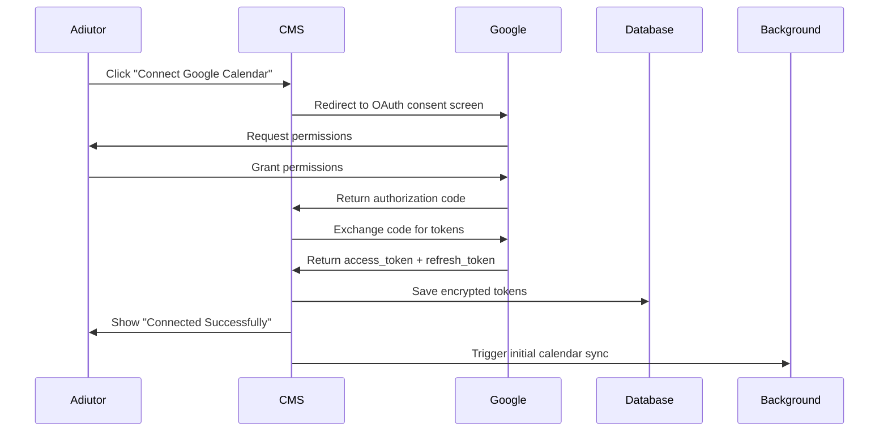

# Schedule Management - Phase 1 Implementation Plan
## Intelligent Schedule View & Interactive Task Placement

**Document Version:** 1.0  
**Created:** October 30, 2025  
**Project:** CMS - Content Management System  
**Repository:** mrkndrwslmn/CMS  
**Phase:** 1 of 2 (Manual Intelligence → Future AI Automation)

---

## 🎯 Executive Summary

### The Problem
Currently, admins assign adiutors to projects **blindly**:
- ❌ No visibility into adiutor availability
- ❌ No way to see current workload
- ❌ No calendar integration
- ❌ Manual guesswork leads to overbooked resources
- ❌ No visual schedule management

### Phase 1 Solution: "Manual Intelligence"
Instead of building a complex AI that auto-assigns, we give admins **perfect information** to make smart manual decisions:

- ✅ **Real-time calendar visibility** via Google Calendar integration
- ✅ **Visual workload indicators** showing who's available
- ✅ **Interactive schedule timeline** to see actual availability
- ✅ **Drag-and-drop task placement** for intuitive scheduling
- ✅ **Simple conflict detection** with visual warnings
- ✅ **Two-way calendar sync** keeping everything updated

### New Feature Implementation

#### 1️⃣ **Assignment Page Transformation**
```
OLD:
[Assign Adiutor: ▼ Select...      ] [Assign]

NEW:
┌────────────────────────────────────────────────────────┐
│ Adiutor Name    │ Calendar │ Workload │ This Week     │
├─────────────────┼──────────┼──────────┼───────────────┤
│ John Developer  │ ✅ Yes   │ 3 proj   │ 🟢 25/40 hrs │ [View Schedule]
│ Sarah Engineer  │ ✅ Yes   │ 5 proj   │ 🔴 38/40 hrs │ [View Schedule]
│ Mike Coder      │ ❌ No    │ 1 proj   │ ❓ Unknown   │ [Send Reminder]
│ Jane Designer   │ ✅ Yes   │ 2 proj   │ 🟡 12/20 hrs │ [View Schedule]
└────────────────────────────────────────────────────────┘
```
Admin instantly sees who's available without guessing!

#### 2️⃣ **Visual Schedule Timeline**
When clicking "View Schedule", a beautiful timeline modal shows:
- 📅 Google Calendar events (meetings, PTO, personal)
- 📋 CMS tasks from other projects
- 🟩 Available time slots highlighted
- 📊 Hour-by-hour breakdown

**Wow**: Complete visibility into adiutor's actual schedule!

#### 3️⃣ **Drag-and-Drop Task Scheduling**
After project assignment, tasks appear in "Unscheduled" bin:
- 🎯 Drag task cards onto calendar
- ⚡ Instant conflict detection
- 🔄 Auto-sync to Google Calendar
- ✅ Visual confirmation

Scheduling feels intuitive and satisfying!

---

## 📋 Table of Contents

1. [Phase 1 Scope](#phase-1-scope)
2. [What We're Building Now](#what-were-building-now)
3. [What We're Deferring to Phase 2](#what-were-deferring-to-phase-2)
4. [Database Schema (Simplified)](#database-schema-simplified)
5. [Feature Specifications](#feature-specifications)
6. [Implementation Plan](#implementation-plan)
7. [Timeline & Deliverables](#timeline--deliverables)
8. [Success Metrics](#success-metrics)
9. [Future-Proofing for Phase 2](#future-proofing-for-phase-2)

---

## Phase 1 Scope

### Core Principle
**"Give admins the exact information they need to make smart manual choices."**

Instead of the system deciding who to assign, we provide:
1. **Real-time visibility** into adiutor availability
2. **Interactive tools** for manual scheduling
3. **Simple automation** for calendar sync and conflict detection
4. **Visual feedback** to guide decisions

### Target Users
- **Admins**: Assign projects and schedule tasks with full visibility
- **Adiutors**: Connect calendars, view their schedule, manage time

### Time Frame
**6-8 weeks** (vs. 12 weeks for full AI system)

---

## What We're Building Now

### ✅ 1. Google Calendar Integration (The Foundation)

**Priority**: 🔴 CRITICAL - This is the engine for everything

#### Features:
- OAuth 2.0 connection flow for adiutors
- Read calendar events (meetings, appointments, PTO)
- Write calendar events (projects, tasks)
- Two-way sync (CMS ↔ Google Calendar)
- Availability cache for performance
- Webhook support for real-time updates

#### Deliverables:
```php
✅ adiutor_calendar_integrations table
✅ adiutor_availability_cache table
✅ GoogleCalendarService (OAuth, CRUD)
✅ CalendarSyncService (background sync)
✅ AvailabilityCalculator (compute free/busy)
✅ OAuth connection UI for adiutors
✅ Calendar sync status dashboard
```

### ✅ 2. Intelligent Manual Assignment Page

**Priority**: 🟡 HIGH

Transform the assignment dropdown into a **decision support dashboard**.

#### Old UI (Current):
```
Assign Adiutor: [Select adiutor ▼] [Assign Button]
```

#### New UI (Phase 1):
```
┌──────────────────────────────────────────────────────────────────┐
│  Assign Adiutor to Project: E-Commerce Website                   │
├──────────────────────────────────────────────────────────────────┤
│                                                                   │
│  Required Skills: PHP, Laravel, Vue.js, MySQL                    │
│  Estimated Hours: 40 hours                                       │
│  Deadline: Dec 15, 2025                                          │
│                                                                   │
│  ┌────────────────────────────────────────────────────────────┐ │
│  │ Adiutor          Calendar  Skills  Workload  Availability  │ │
│  ├────────────────────────────────────────────────────────────┤ │
│  │ John Developer   ✅ Yes    ✓✓✓✓   3 proj   🟢 25/40 hrs  │ │
│  │ ★★★★★ 4.8       Synced 5m ago                             │ │
│  │ Skills: PHP (Expert), Laravel (Adv), Vue.js (Adv)          │ │
│  │ [📅 View Schedule] [Assign Project]                        │ │
│  ├────────────────────────────────────────────────────────────┤ │
│  │ Sarah Engineer   ✅ Yes    ✓✓✓✓   5 proj   🔴 38/40 hrs  │ │
│  │ ★★★★☆ 4.5       Synced 2h ago                             │ │
│  │ Skills: PHP (Expert), Laravel (Expert), MySQL (Adv)        │ │
│  │ ⚠️ Near Capacity - May cause delays                        │ │
│  │ [📅 View Schedule] [Assign Anyway]                         │ │
│  ├────────────────────────────────────────────────────────────┤ │
│  │ Mike Coder       ❌ No     ✓✓✓    1 proj   ❓ Unknown     │ │
│  │ ★★★★☆ 4.2       Never synced                              │ │
│  │ Skills: PHP (Adv), Laravel (Int), Vue.js (Adv)             │ │
│  │ [📧 Send Calendar Reminder] [Assign (Manual Check)]        │ │
│  └────────────────────────────────────────────────────────────┘ │
│                                                                   │
│  💡 Recommendation: John Developer has the right skills and      │
│     availability (25/40 hrs this week). Sarah is at capacity.    │
│                                                                   │
└──────────────────────────────────────────────────────────────────┘
```

#### Data Shown:
| Column | Source | Calculation |
|--------|--------|-------------|
| **Calendar** | `adiutor_calendar_integrations.is_connected` | Real-time status |
| **Skills** | `adiutor_skills` with proficiency | Visual checkmarks |
| **Workload** | `project_assignments` count | Active projects |
| **Availability** | `adiutor_availability_cache` | Hours available this week |
| **Rating** | `adiutor_profiles.rating` | Historical performance |

#### Smart Indicators:
- 🟢 **Green (0-60% capacity)**: Highly available
- 🟡 **Yellow (60-80% capacity)**: Moderate availability
- 🔴 **Red (80-100% capacity)**: Near/at capacity
- ❌ **No calendar**: Unknown availability

### ✅ 3. Visual Schedule Timeline Modal

**Priority**: 🟡 HIGH - The first "wow" moment

When admin clicks **"View Schedule"**, show a detailed timeline.

#### Timeline UI:
```
┌─────────────────────────────────────────────────────────────────┐
│  Schedule: John Developer                              [×]      │
│  Week: Nov 1-7, 2025          [◄ Prev] [Today] [Next ►]       │
├─────────────────────────────────────────────────────────────────┤
│         │  Mon 11/1 │  Tue 11/2 │  Wed 11/3 │  Thu 11/4 │ Fri │
├─────────┼───────────┼───────────┼───────────┼───────────┼─────┤
│ 08:00   │           │           │           │           │     │
│         │           │ ⚫ Meeting│           │           │     │
│ 09:00   │ 🟩 Free   │ ⚫ (1hr)  │ 🟩 Free   │ 📋 Task   │     │
│         │           │           │           │ E-comm    │     │
│ 10:00   │ 🟩 Free   │ 📋 Task   │ 🟩 Free   │ 3 hrs     │     │
│         │           │ CRM (2h)  │           │           │     │
│ 11:00   │ 🟩 Free   │           │ 🟩 Free   │           │     │
│ 12:00   │   Lunch   │   Lunch   │   Lunch   │   Lunch   │     │
│ 13:00   │ 📋 Task   │ 🟩 Free   │ ⚫ All-    │ 🟩 Free   │     │
│         │ API (3h)  │           │   hands   │           │     │
│ 14:00   │           │ 🟩 Free   │ ⚫ Meeting│ 🟩 Free   │     │
│ 15:00   │           │ 🟩 Free   │ ⚫ (2hr)  │ 🟩 Free   │     │
│ 16:00   │ 🟩 Free   │ 🟩 Free   │           │ 🟩 Free   │     │
│ 17:00   │           │           │ 🟩 Free   │           │     │
├─────────┴───────────┴───────────┴───────────┴───────────┴─────┤
│  Summary: 25 hours scheduled | 15 hours available              │
│  Legend: 🟩 Available | 📋 CMS Task | ⚫ Calendar Event        │
│                                                                  │
│  [Close] [Assign to This Adiutor]                              │
└─────────────────────────────────────────────────────────────────┘
```

#### Data Sources:
1. **Google Calendar Events** (⚫): From `adiutor_availability_cache`
2. **CMS Tasks** (📋): From `task_schedules` for existing projects
3. **Available Slots** (🟩): Calculated gaps between events
4. **Working Hours**: From `adiutor_work_schedules` (or default 9-5)

#### Admin Insight:
"I can see John is free Monday morning and Wednesday afternoon. Perfect for the kickoff and planning phase!"

### ✅ 4. Task Scheduling Dashboard

**Priority**: 🟡 HIGH

After assigning a project, admins/adiutors schedule individual tasks.

#### Dashboard Layout:
```
┌─────────────────────────────────────────────────────────────────┐
│  Task Scheduling: E-Commerce Website                            │
│  Assigned to: John Developer                                    │
├─────────────────────────────────────────────────────────────────┤
│                                                                  │
│  Unscheduled Tasks (3)          │  Calendar Timeline            │
│  ┌──────────────────────────┐   │  ┌─────────────────────────┐ │
│  │ 📋 Task: API Setup        │   │  │ Mon 11/1               │ │
│  │ Est: 4 hours             │   │  │ 09:00 🟩 Drop here     │ │
│  │ Priority: High           │   │  │ 10:00 🟩               │ │
│  │ Deadline: Nov 5          │   │  │ 11:00 🟩               │ │
│  │ [Schedule Task]          │   │  │ 12:00 Lunch            │ │
│  └──────────────────────────┘   │  │ 13:00 🟩               │ │
│                                  │  │                         │ │
│  ┌──────────────────────────┐   │  │ Tue 11/2               │ │
│  │ 📋 Task: Database Design  │   │  │ 09:00 ⚫ Meeting       │ │
│  │ Est: 6 hours             │   │  │ 10:00 ⚫               │ │
│  │ Priority: High           │   │  │ 11:00 🟩               │ │
│  │ Deadline: Nov 6          │   │  │ 12:00 Lunch            │ │
│  │ [Schedule Task]          │   │  │ 13:00 📋 Task (2h)     │ │
│  └──────────────────────────┘   │  │ 14:00                   │ │
│                                  │  │ 15:00 🟩               │ │
│  ┌──────────────────────────┐   │  │                         │ │
│  │ 📋 Task: Frontend Setup   │   │  │ Wed 11/3               │ │
│  │ Est: 8 hours             │   │  │ 09:00 🟩               │ │
│  │ Priority: Medium         │   │  │ ...                     │ │
│  │ Deadline: Nov 8          │   │  └─────────────────────────┘ │
│  │ [Schedule Task]          │   │                              │
│  └──────────────────────────┘   │                              │
│                                                                  │
│  💡 Tip: Drag tasks from left to available time slots on right  │
└─────────────────────────────────────────────────────────────────┘
```

### ✅ 5. Drag-and-Drop Task Placement (can be deferred)

**Priority**: 🔴 CRITICAL 

#### How It Works:

**Step 1: Drag Task Card**
```
User grabs "API Setup (4 hours)" card from unscheduled bin
```

**Step 2: Drop on Calendar**
```
User drops on Monday 11/1 at 9:00 AM
```

**Step 3: Validation**
```javascript
✅ Check: Is there a 4-hour block available?
✅ Check: Any conflicts with calendar events?
✅ Check: Within working hours (9 AM - 5 PM)?
```

**Step 4: Visual Feedback**
```
✅ GREEN HIGHLIGHT: "Perfect! Task scheduled successfully"
🟡 YELLOW WARNING: "Partial conflict - overlaps with lunch break"
🔴 RED ERROR: "Cannot schedule - conflicts with meeting at 10 AM"
```

**Step 5: Create Schedule**
```php
// Create task_schedules record
TaskSchedule::create([
    'task_id' => $task->id,
    'adiutor_id' => $adiutor->id,
    'scheduled_start' => '2025-11-01 09:00:00',
    'scheduled_end' => '2025-11-01 13:00:00',
    'estimated_duration_minutes' => 240,
    'schedule_type' => 'manual',
    'is_blocked_time' => true
]);

// Sync to Google Calendar
GoogleCalendarService::createTaskEvent($task, $schedule);
```

**Step 6: Calendar Updates**
```
📅 CMS Timeline: Task appears as scheduled block
📅 Google Calendar: Event created with task details
🔔 Notification: "Task 'API Setup' scheduled for Mon 9 AM"
```

### ✅ 6. Simple Conflict Detection

**Priority**: 🟡 HIGH

#### Conflict Types:

| Type | Detection | Visual Indicator |
|------|-----------|------------------|
| **Time Overlap** | Task overlaps with Google Calendar event | 🔴 Red border + tooltip |
| **Insufficient Duration** | Task needs 4hrs, only 2hrs available | 🟡 Yellow warning + suggestion |
| **Outside Working Hours** | Task scheduled at 8 PM | 🔴 Red + "Outside working hours" |
| **Lunch Break Overlap** | Task crosses 12-1 PM | 🟡 Yellow + "Includes lunch break" |
| **Double Booking** | Slot already has CMS task | 🔴 Red + "Already scheduled" |

#### Conflict Resolution UI:
```
┌─────────────────────────────────────────────────────────┐
│  ⚠️ Scheduling Conflict Detected                       │
├─────────────────────────────────────────────────────────┤
│                                                          │
│  Task: API Setup (4 hours)                              │
│  Attempted Time: Tue, Nov 2, 9:00 AM - 1:00 PM          │
│                                                          │
│  Conflict:                                              │
│  ⚫ Google Calendar Event: "Client Meeting"             │
│     Time: 9:00 AM - 10:00 AM                            │
│                                                          │
│  Suggestions:                                           │
│  ○ Schedule after meeting: 10:00 AM - 2:00 PM ✅        │
│  ○ Split into 2 sessions: 10-12 AM + 1-3 PM            │
│  ○ Choose different day (Wednesday 9 AM is free)        │
│                                                          │
│  [Apply Suggestion] [Choose Manually] [Cancel]          │
└─────────────────────────────────────────────────────────┘
```

### ✅ 7. Two-Way Calendar Sync

**Priority**: 🔴 CRITICAL

#### CMS → Google Calendar (Write)
When task is scheduled:
```javascript
Event Created:
{
  "summary": "[CMS] Task: API Setup - E-Commerce",
  "description": "Project: E-Commerce Website\nPriority: High\nView: https://cms.app/tasks/123",
  "start": "2025-11-01T09:00:00+08:00",
  "end": "2025-11-01T13:00:00+08:00",
  "colorId": "11", // Red for high priority
  "reminders": {
    "overrides": [
      {"method": "popup", "minutes": 15}
    ]
  }
}
```

#### Google Calendar → CMS (Read)
Every 15 minutes + webhook updates:
```php
// Sync calendar events to availability cache
SyncAdiutorCalendar::dispatch($adiutor);

// Updates adiutor_availability_cache with:
- New meetings
- Cancelled appointments
- Out of office periods
- All-day events
```

### ✅ 8. Calendar Connection UI (Adiutor)

**Priority**: 🔴 CRITICAL - Without this, nothing works

#### Connection Flow:
```
┌─────────────────────────────────────────────────────────┐
│  Connect Your Google Calendar                           │
├─────────────────────────────────────────────────────────┤
│                                                          │
│  📅 Why connect your calendar?                          │
│                                                          │
│  ✓ Admins can see your real availability                │
│  ✓ Tasks auto-sync to your Google Calendar              │
│  ✓ Get reminders for upcoming tasks                     │
│  ✓ Prevent double-booking and conflicts                 │
│                                                          │
│  🔒 We only access:                                     │
│  • Free/Busy times (not event details)                  │
│  • Calendar events we create                            │
│                                                          │
│  [🔗 Connect Google Calendar]                           │
│                                                          │
│  Already connected? [View Settings]                     │
└─────────────────────────────────────────────────────────┘
```

After connection:
```
┌─────────────────────────────────────────────────────────┐
│  ✅ Calendar Connected Successfully                     │
├─────────────────────────────────────────────────────────┤
│                                                          │
│  Account: john.dev@gmail.com                            │
│  Status: Active                                         │
│  Last Synced: 2 minutes ago                             │
│                                                          │
│  Working Hours (Default):                               │
│  Monday - Friday: 9:00 AM - 5:00 PM                     │
│  Timezone: Asia/Manila (GMT+8)                          │
│                                                          │
│  [Edit Working Hours] [Disconnect]                      │
└─────────────────────────────────────────────────────────┘
```

---

## What We're Deferring to Phase 2

### ❌ Smart Assignment Algorithm
- No weighted scoring (35% skill + 25% availability + ...)
- No automatic compatibility score calculation
- No AI-powered recommendations
- No "Auto-Assign Top Match" button

**Why defer**: Complex, time-consuming, requires ML tuning

**Phase 1 alternative**: Manual assignment with perfect information

### ❌ Smart Assignment Recommendations Table
- No `smart_assignment_recommendations` table
- No recommendation history tracking
- No A/B testing infrastructure

**Why defer**: Not needed for manual assignment

**Phase 1 alternative**: Inline suggestions in assignment UI

### ❌ Automated Task Scheduling
- No automatic time slot finder
- No AI-driven schedule optimization
- No "Auto-Schedule All Tasks" button
- No dependency-based auto-scheduling

**Why defer**: Complex logic, potential for errors

**Phase 1 alternative**: Intuitive drag-and-drop manual scheduling

### ❌ Advanced Conflict Resolution
- No automatic rescheduling algorithms
- No dependency chain management
- No smart task redistribution

**Why defer**: Requires sophisticated algorithms

**Phase 1 alternative**: Simple visual warnings + suggestions

### ❌ Workload Balancing Engine
- No automatic task distribution across team
- No capacity-based auto-assignment
- No predictive workload analysis

**Why defer**: Complex team coordination logic

**Phase 1 alternative**: Visible workload indicators for manual decisions

### ❌ Task Dependencies System
- No `task_dependencies` table
- No Gantt chart views
- No critical path analysis

**Why defer**: Adds significant complexity

**Phase 1 alternative**: Manual task ordering

---

## Database Schema (Simplified)

### New Tables (Phase 1 Only)

#### 1. adiutor_calendar_integrations
```php
Schema::create('adiutor_calendar_integrations', function (Blueprint $table) {
    $table->id();
    $table->foreignId('adiutor_id')->constrained('users')->onDelete('cascade');
    $table->enum('provider', ['google'])->default('google'); // Start with Google only
    $table->string('calendar_id')->nullable();
    $table->text('access_token')->nullable(); // Encrypted
    $table->text('refresh_token')->nullable(); // Encrypted
    $table->timestamp('token_expires_at')->nullable();
    $table->boolean('is_connected')->default(false);
    $table->timestamp('last_synced_at')->nullable();
    $table->json('sync_settings')->nullable(); // Working hours, timezone
    $table->timestamps();
    
    $table->unique('adiutor_id');
    $table->index('is_connected');
});
```

#### 2. adiutor_availability_cache
```php
Schema::create('adiutor_availability_cache', function (Blueprint $table) {
    $table->id();
    $table->foreignId('adiutor_id')->constrained('users')->onDelete('cascade');
    $table->date('date');
    $table->json('busy_slots')->nullable(); // [{start: '09:00', end: '10:00', title: 'Meeting'}]
    $table->json('free_slots')->nullable(); // [{start: '10:00', end: '12:00'}]
    $table->integer('available_minutes')->default(0);
    $table->boolean('is_working_day')->default(true);
    $table->boolean('is_pto')->default(false);
    $table->timestamp('cached_at');
    $table->timestamps();
    
    $table->unique(['adiutor_id', 'date']);
    $table->index('date');
});
```

#### 3. task_schedules
```php
Schema::create('task_schedules', function (Blueprint $table) {
    $table->id();
    $table->foreignId('task_id')->constrained('tasks', 'taskID')->onDelete('cascade');
    $table->foreignId('adiutor_id')->constrained('users')->onDelete('cascade');
    $table->datetime('scheduled_start');
    $table->datetime('scheduled_end');
    $table->integer('estimated_duration_minutes');
    $table->enum('schedule_type', ['manual', 'auto'])->default('manual'); // Phase 1: always 'manual'
    $table->string('google_calendar_event_id')->nullable();
    $table->timestamp('calendar_synced_at')->nullable();
    $table->timestamps();
    
    $table->index(['adiutor_id', 'scheduled_start']);
    $table->unique('task_id'); // One schedule per task (for now)
});
```

#### 4. adiutor_work_schedules (Optional - can use defaults)
```php
Schema::create('adiutor_work_schedules', function (Blueprint $table) {
    $table->id();
    $table->foreignId('adiutor_id')->constrained('users')->onDelete('cascade');
    $table->enum('day_of_week', ['monday', 'tuesday', 'wednesday', 'thursday', 'friday', 'saturday', 'sunday']);
    $table->time('start_time')->default('09:00:00');
    $table->time('end_time')->default('17:00:00');
    $table->boolean('is_working_day')->default(true);
    $table->timestamps();
    
    $table->unique(['adiutor_id', 'day_of_week']);
});
```

### Extended Tables

#### Extend tasks table
```php
Schema::table('tasks', function (Blueprint $table) {
    $table->integer('estimated_hours')->nullable()->after('allocated_budget');
    $table->boolean('is_scheduled')->default(false)->after('status');
});
```

### Tables We're NOT Building Yet
- ❌ `smart_assignment_recommendations`
- ❌ `task_dependencies`
- ❌ `schedule_conflicts` (we'll show conflicts inline, not store them)
- ❌ Extensions to `project_assignments` for AI tracking

---

## Feature Specifications

### 1. Google Calendar OAuth Flow



#### Scopes Required:
```
https://www.googleapis.com/auth/calendar.readonly  // Read calendar
https://www.googleapis.com/auth/calendar.events    // Create/update events
```

### 2. Availability Calculation Logic

```php
class AvailabilityCalculator
{
    public function calculateWeeklyAvailability(User $adiutor, Carbon $weekStart): array
    {
        $availability = [];
        
        for ($day = 0; $day < 7; $day++) {
            $date = $weekStart->copy()->addDays($day);
            
            // 1. Get working hours (default or custom)
            $workingHours = $this->getWorkingHours($adiutor, $date);
            
            if (!$workingHours['is_working_day']) {
                $availability[$date->format('Y-m-d')] = ['available_minutes' => 0];
                continue;
            }
            
            // 2. Get calendar events from cache
            $cache = AdiutorAvailabilityCache::where('adiutor_id', $adiutor->id)
                ->where('date', $date->format('Y-m-d'))
                ->first();
            
            // 3. Get scheduled CMS tasks
            $scheduledTasks = TaskSchedule::where('adiutor_id', $adiutor->id)
                ->whereDate('scheduled_start', $date)
                ->get();
            
            // 4. Calculate available minutes
            $totalMinutes = $this->calculateWorkingMinutes($workingHours);
            $busyMinutes = ($cache->busy_slots ?? []) + $scheduledTasks;
            $availableMinutes = $totalMinutes - $busyMinutes;
            
            $availability[$date->format('Y-m-d')] = [
                'available_minutes' => max(0, $availableMinutes),
                'busy_slots' => $cache->busy_slots ?? [],
                'tasks' => $scheduledTasks
            ];
        }
        
        return $availability;
    }
    
    private function getWorkingHours(User $adiutor, Carbon $date): array
    {
        $schedule = AdiutorWorkSchedule::where('adiutor_id', $adiutor->id)
            ->where('day_of_week', strtolower($date->format('l')))
            ->first();
        
        // Default: Monday-Friday 9 AM - 5 PM
        return $schedule ?? [
            'is_working_day' => $date->isWeekday(),
            'start_time' => '09:00:00',
            'end_time' => '17:00:00'
        ];
    }
}
```

### 3. Conflict Detection Algorithm

```php
class ConflictDetector
{
    public function checkConflict(Task $task, Carbon $scheduledStart, int $durationMinutes): ?array
    {
        $scheduledEnd = $scheduledStart->copy()->addMinutes($durationMinutes);
        $adiutor = $task->assignedUser;
        
        // 1. Check working hours
        if (!$this->isWithinWorkingHours($adiutor, $scheduledStart, $scheduledEnd)) {
            return [
                'type' => 'outside_working_hours',
                'severity' => 'high',
                'message' => 'Task scheduled outside working hours',
                'suggestion' => 'Schedule between 9 AM - 5 PM'
            ];
        }
        
        // 2. Check calendar events
        $calendarConflict = $this->checkCalendarConflict($adiutor, $scheduledStart, $scheduledEnd);
        if ($calendarConflict) {
            return $calendarConflict;
        }
        
        // 3. Check existing task schedules
        $taskConflict = $this->checkTaskConflict($adiutor, $scheduledStart, $scheduledEnd, $task->id);
        if ($taskConflict) {
            return $taskConflict;
        }
        
        // 4. Check lunch break (12-1 PM)
        if ($this->overlapsLunchBreak($scheduledStart, $scheduledEnd)) {
            return [
                'type' => 'lunch_break_overlap',
                'severity' => 'medium',
                'message' => 'Task includes lunch break (12-1 PM)',
                'suggestion' => 'Schedule before 12 PM or after 1 PM'
            ];
        }
        
        return null; // No conflicts
    }
    
    private function checkCalendarConflict($adiutor, $start, $end): ?array
    {
        $cache = AdiutorAvailabilityCache::where('adiutor_id', $adiutor->id)
            ->whereDate('date', $start->format('Y-m-d'))
            ->first();
        
        if (!$cache || !$cache->busy_slots) {
            return null;
        }
        
        foreach ($cache->busy_slots as $slot) {
            $slotStart = Carbon::parse($slot['start']);
            $slotEnd = Carbon::parse($slot['end']);
            
            if ($this->timesOverlap($start, $end, $slotStart, $slotEnd)) {
                return [
                    'type' => 'calendar_event',
                    'severity' => 'high',
                    'message' => "Conflicts with: {$slot['title']}",
                    'conflicting_event' => $slot,
                    'suggestion' => "Schedule after {$slotEnd->format('g:i A')}"
                ];
            }
        }
        
        return null;
    }
}
```

### 4. Drag-and-Drop Frontend Logic

```javascript
// resources/js/components/TaskScheduler.vue

<template>
  <div class="task-scheduler">
    <!-- Unscheduled Tasks Bin -->
    <div class="unscheduled-tasks">
      <h3>Unscheduled Tasks</h3>
      <draggable 
        v-model="unscheduledTasks" 
        :group="{ name: 'tasks', pull: 'clone', put: false }"
        @start="onDragStart"
        @end="onDragEnd">
        <div 
          v-for="task in unscheduledTasks" 
          :key="task.id"
          class="task-card"
          :data-task-id="task.id"
          :data-duration="task.estimated_hours">
          <h4>{{ task.taskTitle }}</h4>
          <p>{{ task.estimated_hours }} hours</p>
          <span :class="priorityClass(task.priority)">
            {{ task.priority }}
          </span>
        </div>
      </draggable>
    </div>

    <!-- Calendar Timeline -->
    <div class="calendar-timeline">
      <div v-for="day in weekDays" :key="day.date" class="day-column">
        <h4>{{ day.label }}</h4>
        
        <div class="time-slots">
          <div 
            v-for="slot in day.timeSlots" 
            :key="slot.time"
            :class="slotClass(slot)"
            @drop="onDrop($event, day.date, slot.time)"
            @dragover.prevent
            @dragenter="onDragEnter($event, slot)"
            @dragleave="onDragLeave($event)">
            
            <!-- Display slot time -->
            <span class="time-label">{{ slot.time }}</span>
            
            <!-- Display existing events -->
            <div v-if="slot.event" :class="eventClass(slot.event)">
              {{ slot.event.title }}
            </div>
            
            <!-- Drop zone indicator -->
            <div v-if="slot.isDropZone" class="drop-indicator">
              Drop here ({{ slot.availableHours }} hrs)
            </div>
          </div>
        </div>
      </div>
    </div>
  </div>
</template>

<script>
export default {
  methods: {
    async onDrop(event, date, time) {
      const taskId = event.dataTransfer.getData('task-id');
      const duration = parseInt(event.dataTransfer.getData('duration'));
      
      const scheduledStart = `${date} ${time}`;
      
      // Check for conflicts
      const conflict = await this.checkConflict(taskId, scheduledStart, duration);
      
      if (conflict && conflict.severity === 'high') {
        this.showConflictModal(conflict);
        return;
      }
      
      if (conflict && conflict.severity === 'medium') {
        const confirmed = await this.confirmSchedule(conflict);
        if (!confirmed) return;
      }
      
      // Schedule the task
      await this.scheduleTask(taskId, scheduledStart, duration);
      
      // Show success message
      this.$toast.success('Task scheduled successfully!');
      
      // Refresh timeline
      this.loadSchedule();
    },
    
    async checkConflict(taskId, scheduledStart, durationHours) {
      const response = await axios.post('/api/schedule/check-conflict', {
        task_id: taskId,
        scheduled_start: scheduledStart,
        duration_minutes: durationHours * 60
      });
      
      return response.data.conflict;
    },
    
    async scheduleTask(taskId, scheduledStart, durationHours) {
      await axios.post('/api/schedule/task', {
        task_id: taskId,
        scheduled_start: scheduledStart,
        duration_minutes: durationHours * 60
      });
    },
    
    slotClass(slot) {
      return {
        'time-slot': true,
        'available': slot.isAvailable,
        'busy': slot.event,
        'calendar-event': slot.event?.type === 'calendar',
        'cms-task': slot.event?.type === 'task',
        'drop-zone': slot.isDropZone
      };
    }
  }
}
</script>
```

---

## Implementation Plan

### Week 1-2: Foundation - Google Calendar Integration

#### Deliverables:
```
✅ Google Cloud Console setup
✅ OAuth 2.0 credentials configured
✅ Database migrations (3 tables)
✅ GoogleCalendarService class
✅ OAuth connection flow (routes + controller)
✅ Calendar connection UI for adiutors
✅ Basic sync job (manual trigger)
```

#### Tasks:
1. **Setup Google Cloud Project** (2 hours)
   - Create project in Google Cloud Console
   - Enable Calendar API
   - Create OAuth 2.0 credentials
   - Configure redirect URIs

2. **Database Migrations** (4 hours)
   - Create `adiutor_calendar_integrations` table
   - Create `adiutor_availability_cache` table
   - Create `task_schedules` table
   - Create `adiutor_work_schedules` table (optional)
   - Extend `tasks` table

3. **Google Calendar Service** (12 hours)
   - OAuth connection flow
   - Token refresh logic
   - Read calendar events (free/busy)
   - Create calendar events
   - Update calendar events
   - Delete calendar events
   - Error handling + retry logic

4. **Calendar Sync Service** (8 hours)
   - Fetch calendar events for date range
   - Parse and normalize event data
   - Update availability cache
   - Handle webhook subscriptions (optional for Phase 1)

5. **Connection UI** (6 hours)
   - "Connect Calendar" page for adiutors
   - OAuth redirect handling
   - Connection status display
   - Disconnect functionality
   - Sync status indicator

6. **Testing** (4 hours)
   - Unit tests for GoogleCalendarService
   - Feature test for OAuth flow
   - Test calendar sync

**Total: 36 hours (1.5 weeks)**

---

### Week 3-4: Intelligent Assignment Page

#### Deliverables:
```
✅ Enhanced assignment page UI
✅ Workload calculator
✅ Availability aggregator
✅ Visual timeline modal
✅ Calendar reminder system
```

#### Tasks:
1. **Workload Calculator** (6 hours)
   - Count active projects per adiutor
   - Calculate weekly scheduled hours
   - Determine capacity status (green/yellow/red)
   - Create helper methods on User model

2. **Assignment Page Redesign** (12 hours)
   - Replace dropdown with table view
   - Show calendar status per adiutor
   - Display workload and availability
   - Add skill indicators
   - Show rating and project count
   - Add "View Schedule" buttons

3. **Schedule Timeline Modal** (16 hours)
   - Week view layout
   - Fetch and display calendar events
   - Fetch and display CMS tasks
   - Calculate free slots
   - Color coding (calendar vs tasks vs free)
   - Navigation (prev/next week)
   - Summary statistics

4. **Calendar Reminder System** (4 hours)
   - "Send Reminder" button for disconnected calendars
   - Email template for calendar connection
   - Track reminder sent status

5. **Testing** (4 hours)
   - Test workload calculations
   - Test availability aggregation
   - Test timeline modal rendering

**Total: 42 hours (2 weeks)**

---

### Week 5-6: Task Scheduling Dashboard & Drag-and-Drop

#### Deliverables:
```
✅ Task scheduling dashboard
✅ Drag-and-drop functionality
✅ Conflict detection
✅ Two-way calendar sync
✅ Schedule management API
```

#### Tasks:
1. **Task Scheduling Dashboard** (10 hours)
   - Layout: unscheduled tasks + timeline
   - Fetch unscheduled tasks for project
   - Display task cards with details
   - Load adiutor's schedule
   - Week/day view toggle

2. **Drag-and-Drop Implementation** (14 hours)
   - Install Vue Draggable library
   - Make task cards draggable
   - Create drop zones on timeline
   - Handle drag start/end events
   - Visual feedback during drag
   - Drop validation

3. **Conflict Detection Service** (10 hours)
   - ConflictDetector class
   - Check working hours
   - Check calendar events
   - Check existing tasks
   - Check lunch breaks
   - Return conflict details + suggestions

4. **API Endpoints** (8 hours)
   ```
   POST /api/schedule/check-conflict
   POST /api/schedule/task
   PUT  /api/schedule/task/{id}
   DELETE /api/schedule/task/{id}
   GET  /api/schedule/adiutor/{id}/timeline
   ```

5. **Calendar Event Creation** (6 hours)
   - CalendarEventManager service
   - Create event when task scheduled
   - Update event when task rescheduled
   - Delete event when task unscheduled
   - Include task details in description
   - Set appropriate reminders

6. **Conflict Resolution UI** (6 hours)
   - Modal for high-severity conflicts
   - Inline warnings for medium conflicts
   - Display suggestions
   - Allow manual override

7. **Testing** (6 hours)
   - Test conflict detection logic
   - Test calendar sync
   - Test drag-and-drop scenarios
   - E2E test for scheduling flow

**Total: 60 hours (3 weeks)**

---

### Week 7-8: Polish, Testing & Documentation

#### Deliverables:
```
✅ Performance optimization
✅ Error handling
✅ Admin documentation
✅ Adiutor guide
✅ Deployment preparation
```

#### Tasks:
1. **Performance Optimization** (8 hours)
   - Add database indexes
   - Implement caching for availability
   - Optimize calendar sync queries
   - Lazy load timeline data

2. **Error Handling** (6 hours)
   - Calendar API failure recovery
   - Token expiration handling
   - Network error handling
   - User-friendly error messages

3. **UI Polish** (8 hours)
   - Responsive design
   - Loading states
   - Empty states
   - Tooltips and help text
   - Accessibility improvements

4. **Documentation** (6 hours)
   - Admin guide: "How to assign with confidence"
   - Adiutor guide: "Connect your calendar"
   - "Schedule tasks efficiently" tutorial
   - API documentation

5. **Integration Testing** (8 hours)
   - Full workflow tests
   - Calendar integration tests
   - Multi-adiutor scenarios
   - Edge case testing

6. **Deployment Preparation** (4 hours)
   - Environment configuration
   - Queue setup for sync jobs
   - Cronjob for periodic sync
   - Monitoring and logging

**Total: 40 hours (2 weeks)**

---

## Timeline & Deliverables

### 8-Week Implementation Schedule

| Week | Phase | Deliverables | Hours |
|------|-------|--------------|-------|
| **1-2** | Google Calendar Integration | OAuth, Sync, Database | 36h |
| **3-4** | Intelligent Assignment | Enhanced UI, Timeline Modal | 42h |
| **5-6** | Task Scheduling | Drag-and-Drop, Conflicts | 60h |
| **7-8** | Polish & Deploy | Testing, Docs, Launch | 40h |
| **Total** | - | - | **178h** |

### Key Milestones

- ✅ **Week 2**: Adiutors can connect Google Calendar
- ✅ **Week 4**: Admins see real availability when assigning
- ✅ **Week 6**: Drag-and-drop task scheduling works
- ✅ **Week 8**: Production ready and deployed

---

## Success Metrics

### Quantitative KPIs (3 Months Post-Launch)

| Metric | Target | Measurement |
|--------|--------|-------------|
| **Calendar Connection Rate** | 80%+ adiutors | % with `is_connected = true` |
| **Assignment Confidence** | 90%+ assignments use timeline | Track "View Schedule" clicks |
| **Scheduling Efficiency** | 75%+ tasks scheduled successfully | Track scheduled vs unscheduled |
| **Conflict Rate** | < 10% conflicts | Count conflicts shown |
| **Admin Time Saved** | 50% reduction | Survey + time tracking |
| **User Satisfaction** | 4.5/5 stars | Admin + adiutor surveys |

### Qualitative KPIs

- ✅ Admins feel confident in assignment decisions
- ✅ Adiutors appreciate calendar integration
- ✅ Reduced scheduling errors and double-booking
- ✅ Better work-life balance for adiutors
- ✅ Increased visibility into team capacity

---

## Future-Proofing for Phase 2

### How Phase 1 Enables Phase 2

#### Data We're Already Collecting:
```
✅ Adiutor skills + proficiency levels (existing)
✅ Calendar availability (new)
✅ Current workload (existing + enhanced)
✅ Performance ratings (existing)
✅ Task scheduling history (new)
✅ Conflict patterns (new)
```

#### Services We're Building:
```
✅ GoogleCalendarService → Ready for webhooks
✅ AvailabilityCalculator → Ready for scoring
✅ ConflictDetector → Ready for auto-resolution
✅ CalendarEventManager → Ready for bulk operations
```

#### UI Components:
```
✅ Assignment table → Add "Auto-Assign" button
✅ Schedule timeline → Add "Optimize" button
✅ Task scheduler → Add "Auto-Schedule" button
```

### Phase 2 Additions (Future):

```php
// Easy upgrade path:

// 1. Add smart_assignment_recommendations table
Schema::create('smart_assignment_recommendations', ...);

// 2. Create AssignmentScoreCalculator service
class AssignmentScoreCalculator {
    public function calculateScore(Project $project, User $adiutor): float
    {
        // Uses existing data:
        $skillScore = $this->skillMatcher->match($project, $adiutor);
        $availabilityScore = $this->availabilityCalculator->score($adiutor);
        $workloadScore = $this->workloadAnalyzer->score($adiutor);
        
        return ($skillScore * 0.5) + ($availabilityScore * 0.3) + ($workloadScore * 0.2);
    }
}

// 3. Add "Get Recommendations" button to assignment page
Route::get('/admin/projects/{id}/recommendations', [SmartAssignmentController::class, 'getRecommendations']);

// 4. Add "Auto-Schedule" button to task scheduler
Route::post('/api/schedule/auto-optimize', [TaskSchedulerController::class, 'autoOptimize']);
```

**Result**: Phase 1 becomes the foundation, Phase 2 adds AI on top!

---

## Risk Mitigation

### High-Risk Items

| Risk | Probability | Impact | Mitigation |
|------|-------------|--------|------------|
| **Low calendar adoption** | Medium | High | Incentives, reminders, admin enforcement |
| **Google API changes** | Low | High | Version pinning, monitoring, fallback |
| **Calendar sync failures** | Medium | Medium | Retry logic, error notifications, manual sync |
| **UI complexity** | Low | Medium | User testing, iterative refinement, tutorials |

### Contingency Plans

**If calendar adoption is low (<50%):**
- Enable manual availability input as fallback
- Show benefits prominently in dashboard
- Send weekly reminders to disconnected adiutors
- Admin can mark adiutors as "requires calendar"

**If drag-and-drop is confusing:**
- Add "Schedule Task" button as alternative
- Include guided tutorial on first use
- Provide keyboard shortcuts
- Add video walkthrough

---

## Appendix

### A. Technology Stack
- **Backend**: Laravel 11, PHP 8.2+
- **Database**: MySQL 8.0+
- **Queue**: Redis (for calendar sync jobs)
- **Cache**: Redis (for availability cache)
- **External API**: Google Calendar API v3
- **Frontend**: Blade + Alpine.js + Vue 3 (for drag-and-drop)
- **UI Library**: Tailwind CSS
- **Drag-and-Drop**: Vue Draggable (SortableJS)

### B. API Endpoints Summary

```php
// Calendar Management
GET  /api/calendar/connect              // Initiate OAuth
GET  /api/calendar/callback             // OAuth callback
POST /api/calendar/disconnect           // Remove connection
GET  /api/calendar/status               // Connection status
POST /api/calendar/sync                 // Manual sync

// Schedule Management
GET  /api/schedule/adiutor/{id}/timeline           // Get timeline
GET  /api/schedule/adiutor/{id}/availability       // Get availability
POST /api/schedule/check-conflict                  // Check conflict
POST /api/schedule/task                            // Schedule task
PUT  /api/schedule/task/{id}                       // Update schedule
DELETE /api/schedule/task/{id}                     // Unschedule task
GET  /api/schedule/unscheduled/{projectId}         // Get unscheduled tasks
```

### C. Database ER Diagram

```
users (existing)
  ├─ adiutor_calendar_integrations (1:1)
  │   └─ provider, tokens, is_connected
  │
  ├─ adiutor_availability_cache (1:many)
  │   └─ date, busy_slots, free_slots, available_minutes
  │
  ├─ adiutor_work_schedules (1:many)
  │   └─ day_of_week, start_time, end_time
  │
  └─ task_schedules (through tasks)
      └─ task_id, scheduled_start, scheduled_end, google_calendar_event_id

tasks (existing)
  └─ task_schedules (1:1)
      └─ scheduled_start, scheduled_end, duration
```

---

**Document Owner**: Development Team  
**Last Updated**: October 30, 2025  
**Version**: 1.0  
**Status**: 📋 Ready for Implementation

---

## Next Steps

### Immediate Actions (This Week)
1. ✅ Review and approve Phase 1 plan
2. ✅ Set up Google Cloud Project
3. ✅ Generate OAuth 2.0 credentials
4. ✅ Create development branch: `feature/schedule-management-phase1`
5. ✅ Schedule team kickoff meeting

### Pre-Development Checklist
- [ ] Google Cloud Console access granted
- [ ] OAuth credentials configured in `.env`
- [ ] Redis queue configured
- [ ] Development environment tested
- [ ] Team roles assigned
- [ ] Week 1 tasks scheduled

---

*This is a living document and will be updated as Phase 1 progresses. Phase 2 (AI Automation) plan will be created upon successful completion of Phase 1.*
